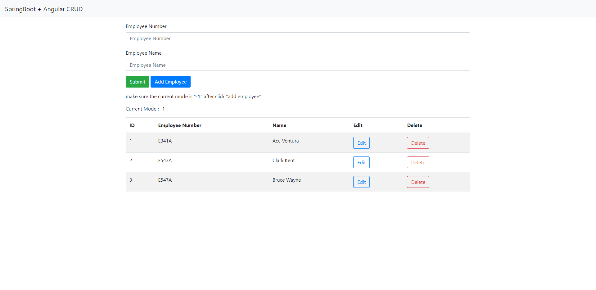

# EmployeeSystem

This project is a web application to create read update and delete employees from a system utilizing Spring Boots for the backend and Angular + Bootstrap for the frontend

  
  <b>home page where users can create read update and delete employees from the system</b> 

## Stack
- Spring Boot - Backend   
- Javascript - Backend
- JavaScript (Angular) - Frontend 
- Boostrap - Frontend
- HTML/CSS - Frontend

## Objective

- The main objective of this project is to better understand and learn how Spring Boots and Angular function

## Authors
- [@xsfar](https://github.com/xsfar) 
